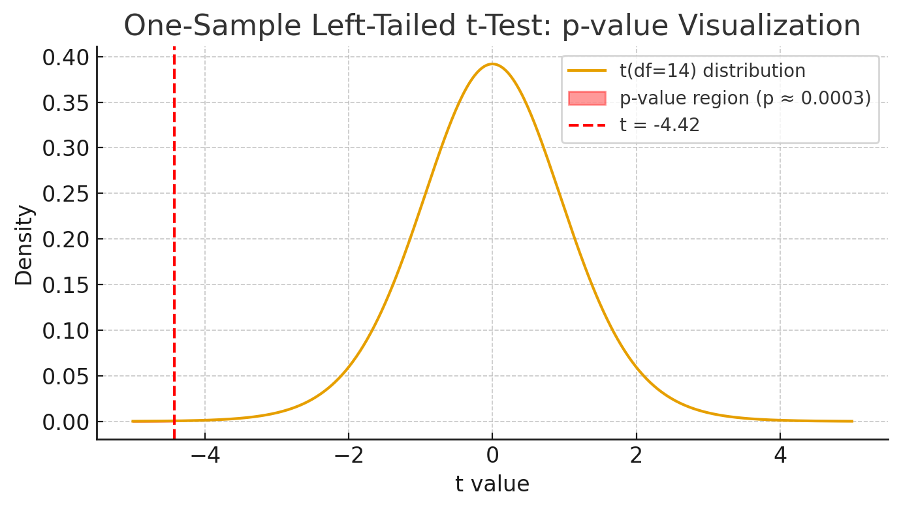

```{r setup, include=FALSE}
knitr::opts_chunk$set(echo = TRUE)
```

```{r preamble, echo=FALSE, message=FALSE}
library(tidyverse)
```


**Note**: The function `pnorm()` gives the cumulative probability for a **normal distribution** up to a certain value. That is, it tells you \( P(X \leq x) \). Use the problems below to practice computing and interpreting probabilities with the normal distribution.


## Problem 1: Basic Standard Normal Probability

Find the probability that a standard normal variable \( Z \) is less than 1.25.
What does this number represent?

```{r}
pnorm(1.25)
```

This number represents the area under the standard normal curve to the left of 1.25.


## Problem 2: Two-Sided Probability


Compute the probability that Z lies between -1.5 and 1.5.

```{r}
pnorm(1.5) - pnorm(-1.5)
```

This answers the question: What proportion of the standard normal distribution is within 1.5 SDs of the mean? It's 87%.


**Note**: The rest of the problems are about t-tests.

## Problem 3: t-test 

- What is a t-test for?

A t-test is a statistical test used to determine whether the mean of one group (or the difference between two groups) is statistically different from a specific value or from each other.

- What types of t-tests are there? 

There are three types: a one-sample t-test, a two-sample t-test, and a paired t-test (which reduces to a one-sample t-test).

- What are the assumptions for t-tests?

One-sample t-test:

- Independence: The observations are independent of each other (random sample, no clustering).
- Normality: The variable is approximately normally distributed in the population. (For large n, the Central Limit Theorem makes this less critical.)

Two-sample t-test:

- Independence between and within groups: Different groups are independent and observations within each group are independent.
- Normality: The variable is approximately normal within each group.
- Equal variances (for pooled test only): Pooled t-test assumes that the variances of each group are equal.n Welch’s t-test does not require this.

Paired t-test:
- Dependent pairs: The two measurements are logically linked.
- Independence between pairs: One pair’s difference does not influence another’s.
- Normality of differences: The differences (e.g., after - before) are approximately normally distributed.

- How to test normality?

For large samples (with more than 30 points), the Central Limit Theorem makes this less critical. For small samples, you should check normality using plots. This is all you need for this class: histogram or qq plot:

qqnorm(x)
qqline(x, col = "red")

There are statistical tests for this as well, but we will not cover them: Shapiro–Wilk test and Kolmogorov–Smirnov test.

## Problem 4: Perform a one-sample t-test

A criminologist believes that the average daily number of arrests in a city is less than 25. She collects a random sample of 15 days and finds the data in problem1_arrests.csv.

- State the null and alternative hypotheses.

H0: the average daily number of arrests in a city is not less than 25, i.e., the average is greater than or equal to 25.
H1: the average daily number of arrests in a city is less than 25.

- Check assumptions for a one-sample t-test (random sample, approximate normality).

  - Random sample: cannot test directly, but we are told it is a random sample
  - Approximate normality: check with qqplot and it looks good. 

The qqplot is more reliable than the histogram, because it ignores the bounded range and compares quantiles directly. If the Q–Q plot is roughly linear, that’s strong evidence that your data are not too far from normality.

If the data are heavily skewed, especially with a small sample size, it's better to use a nonparametric alternative like the Wilcoxon signed-rank test or Wilcoxon rank-sum test. (We will not cover these in class.)


```{r}
library(tidyverse)
dat1 <- read_csv("/Users/mariacuellar/Github/crim_data_analysis/data/problem1_arrests.csv")

arrests <- dat1$Arrests

hist(arrests)

qqnorm(arrests)
qqline(arrests, col = "red")

```


- Perform the t-test.

```{r}
t.test(arrests, mu=25, alternative = "less")
```

- Report and interpret the test statistic, degrees of freedom, and p-value.

In general, $t=\frac{\overline{x} - \mu_0}{s/\sqrt{n}}$, where $t$ is the test statistic, $\overline{x}$ is the sample mean, $\mu_0$ is the hypothesized population mean from $H_0$, $s$ is the sample standard deviation, $n$ is the sample size, and $s/\sqrt{n}$ is the standard error of the mean.


For this problem:

$t=\frac{21.73 - 25}{2.87/\sqrt{15}} = -4.42$

The denominator rescales that difference by how much variability you expect due to sampling (the standard error). A large t (positive or negative) means the observed mean is many standard errors away from the hypothesized value, and thus is evidence against the null hypothesis.

To compute the p-value using the t distribution, in R, the function pt() gives the cumulative probability for a t-value:

```{r}
# one-sided, left-tail
p_value <- pt(-4.42, df = 14)
p_value
```
(Note that if it were a two-tailed test, then the p-value would be calculated as 2 * pt(-abs(-4.42), df = 14).)

The p-value is the area under the t curve beyond your observed t value (in one or both tails), according to the null model.


{width=550px}


The shaded area represents the p-value, i.e., the probability of getting a t statistic this extreme or smaller if the null hypothesis were true.

Here, the test statistic t is -4.4156, the df is 14 and the p-value is 0.0003.

- Write a short paragraph interpreting the results in context.

The sample of 15 days shows an average of 21.7 arrests per day, which is noticeably lower than the hypothesized population mean of 25. The one-sample t-test gives p=0.00029. Because this p-value is far below 0.05, we reject the null hypothesis and conclude that the true mean number of daily arrests in this city is statistically significantly less than 25. In other words, it is very unlikely that we would observe a sample this low if the actual average number of arrests were 25. This result provides strong statistical evidence that daily arrests have declined below the level assumed by the criminologist.


## Problem 5: Perform a two-sample t-test

Researchers compare the mean sentence length (in months) given by two judges. Random samples of sentences are recorded in problem2_judges.csv.

- State H0 and Ha.

$H_0: mu_1 = mu_2.$

$H_a: mu_1 \neq mu_2$.

- Check assumptions (independence, approximate normality, equal variances if needed).

Independence holds because the data are random samples of sentences. 

Normality: 

```{r}
dat2 <- read_csv("/Users/mariacuellar/Github/crim_data_analysis/data/problem2_judges.csv")

sentencelengthA <- dat2 %>% filter(Judge=="A") %>% select(SentenceLength) %>% pull()
sentencelengthB <- dat2 %>% filter(Judge=="B") %>% select(SentenceLength) %>% pull()

dat2 %>% ggplot(aes(y=SentenceLength)) + geom_histogram() + facet_wrap(~Judge)
```

Too hard to tell with histograms. Let's try qqplot. 

```{r}
qqnorm(sentencelengthA)
qqline(sentencelengthA, col = "red")

qqnorm(sentencelengthB)
qqline(sentencelengthB, col = "red")
```

Looks good.

- Conduct both:
  - a pooled (equal variances) t-test, and
  - a Welch (unequal variances) t-test.
- Compare results. Which test seems more appropriate?
- Interpret in context.

Let's look at the data: 
```{r}
dat2 %>% ggplot(aes(y=SentenceLength, fill=Judge)) + geom_boxplot()

sd(sentencelengthA)
sd(sentencelengthB)

```
Standard deviations (sqrt of variance) look similar.


```{r}
# Equal variance:
t.test(sentencelengthA, sentencelengthB, var.equal = TRUE)

# Not equal variance:
t.test(sentencelengthA, sentencelengthB, var.equal = FALSE)
```
The test results are similar. The equal variance one seems more appropriate. 

The mean sentence length given by male judges was statistically significantly higher than that of female judges. This suggests that male judges tend to give longer sentences, on average, than female judges.


## Problem 6: Perform a Paired t-test

Police cadets are tested on physical fitness before and after a 10-week training program: see problem3_cadets.csv.

- Why is this a paired design?

Because the individuals are repeated in the data, with one point before and one point after. 

```{r}
dat3 <- read_csv("/Users/mariacuellar/Github/crim_data_analysis/data/problem3_cadets.csv")
```

- Conduct a paired t-test.

H0: difference = 0
H1: different $\neq$ 0.

```{r}

dat3 <- dat3 %>% mutate(Difference = After-Before)

difference <- dat3$Difference

t.test(difference)

```

- Report the t statistic, df, and p-value.

t = 6.0613, df = 5, p-value = 0.001764


- Interpret whether the training improved fitness.

A paired t-test was conducted to compare participants’ fitness scores before and after the training program. The average post-training score was higher than the pre-training score, and the difference was statistically significant with p = 0.006. These results suggest that the training program led to a significant improvement in participants’ fitness levels.


## Problem 7: Inference with linear regression

Do inference on the slope coefficient for the regression you performed in Exercises 5, lm(price ~ sqft, data=dat), using philadelphia_house_prices.csv.

```{r}
dathousing <- read_csv("/Users/mariacuellar/Github/crim_data_analysis/data/philadelphia_house_prices.csv")

out <- lm(price ~ sqft, data=dathousing)
summary(out)

```

Each additional sqft is associated with an additional $0.12, and this is statistically significant at the 0.05 level with p being close to zero.


