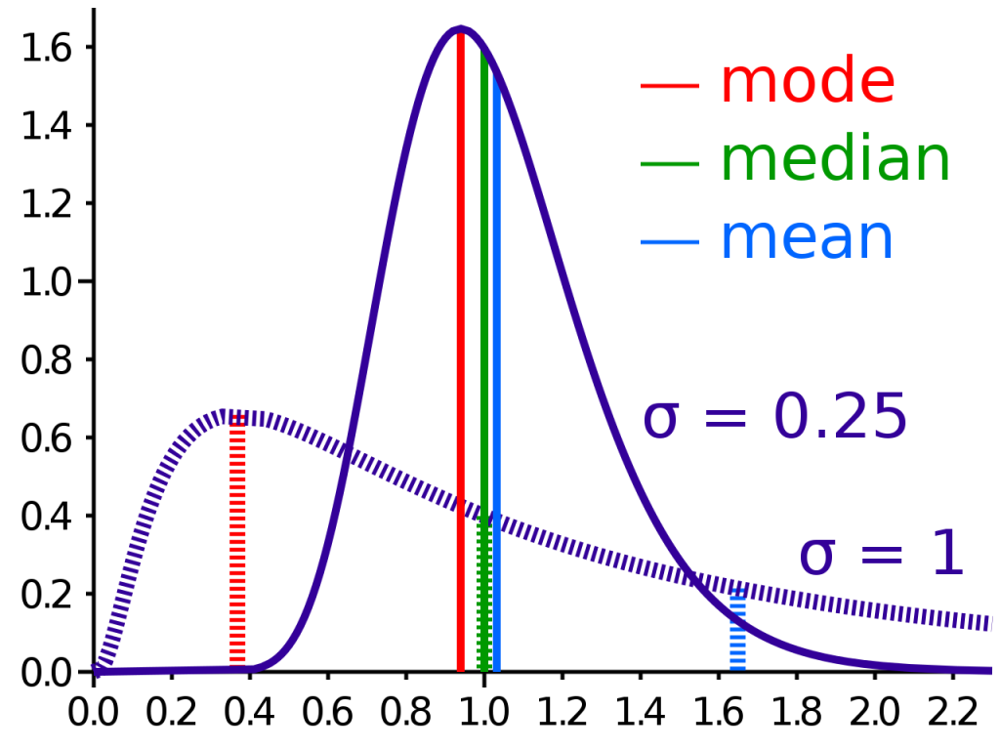

```{r setup, include=FALSE}
knitr::opts_chunk$set(echo = TRUE)
```

# EDA text

Find the entire EDA text here: https://github.com/mariacuellar/crim_data_analysis/blob/main/workshops/EDA%20-%20chapter4.pdf

This text was written by Howard Seltman, a statistician and physician at Carnegie Mellon University.


# Quantitative EDA

## For a single quantitative variable

```{r, include=FALSE}
library(tidyverse)
```

First look at the histogram. Is it uniform? Then summarize using the range. 

```{r}
mpg %>% select(cty) %>% reframe(range=range(cty)) 
# note that I used reframe instead of summarize because it's two values
```

If it is bimodal, then describe the two modes. Perhaps it's worth it to split up the data and analyze it as two separate unimodal distributions.

If it is unimodal, then check whether it is symmetric, visually. There are tests for this (e.g., a qq plot), but it's usually good enough to see it.

If it is symmetric, then provide the mean and sd. 

```{r}
mpg %>% select(cty) %>% summarise(mean=mean(cty), sd=sd(cty))
```

If it is not symmetric, then provide the median and IQR. You need to say whether it is skewed to the right or left, meaning does it have a long tail on the right or left. A long tail on the right is a right-skewed distribution. 





```{r}
mpg %>% select(cty) %>% summarise(median=median(cty), IQR=IQR(cty))
```

In fact, one way to test whether the distribution is symmetric is by comparing the median to the mean. If they are equal, then the distribution is symmetric.


You can also see all the summary statistics together if you like.
```{r}
mpg %>% select(cty) %>% summarise(mean=mean(cty), 
                                  sd=sd(cty),
                                  median=median(cty), 
                                  IQR=IQR(cty)
                                  )
```

There is no built-in mode function in R, but you can calculate it this way. 

```{r}
# define a new function for mode, call it Mode
Mode <- function(x) {
  ux <- unique(x)
  ux[which.max(tabulate(match(x, ux)))]
}

# use it on your variable
Mode(mpg$cty)

```


