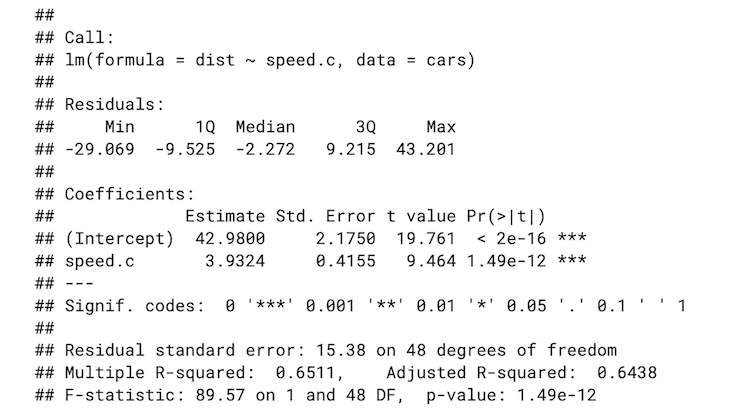

title: "Hypothesis testing"
output:
  html_document:
    toc: true
    toc_float: true
    collapsed: false
    number_sections: false
    toc_depth: 2
    #code_folding: hide


```{r setup, include=FALSE}
knitr::opts_chunk$set(message=FALSE,warning=FALSE, cache=TRUE)
```


# Statistical inference

- **Definition**: The process of analyzing data to infer properties of a population, for example by testing hypotheses and deriving estimates. It is assumed that the observed data set is sampled from a larger population.


# Hypothesis testing

- **Definition**: The process of drawing conclusions on the basis of statistical testing of collected data.


- **Goal**: To draw conclusions about a population on the basis of data obtained from a sample of that population.


- **How it works**: In hypothesis testing, we start with some default theory — called a null hypothesis — and we ask if the data provide sufficient evidence (via a test statistic) to reject the theory. If not we retain the null hypothesis.


# Testing diff. in means: Single-sample t-test


# Testing diff. in means: Two-sample t-test


# t-test

- The t-test is used to determine if the means of two sets of data are significantly different from each other.


- It is mostly used when the data sets, like the data set recorded as the outcome from flipping a coin 100 times, would follow a normal distribution and may have unknown variances. A t-test is used as a hypothesis testing tool, which allows testing of an assumption applicable to a population. 


- A t-test looks at the t-statistic, the t-distribution values, and the degrees of freedom to determine the statistical significance. To conduct a test with three or more means, one must use an analysis of variance.


# Hypothesis test for linear regression slope

If there is a significant linear relationship between the independent variable $x$ and the dependent variable $y$, the slope will not equal zero.


State the hypotheses:
$$
H_0: b_1 = 0,\ \ \ H_A: b_1 \neq 0.
$$

The null hypothesis states that the slope is equal to zero, and the alternative hypothesis states that the slope is not equal to zero.


###Note: Think of analogy to "innocent until proven guilty".


# Significance level

Select a significance level, $\alpha$. The most common one is 5%. Some scientific questions (e.g. elementary particles) and medical questions (e.g. vaccines) require lower significance levels (e.g. 1% or 0.1%). This means the test is more conservative, so it's harder to get significance by chance.  

$\alpha$ is also the probability of obtaining a Type I error, and $\beta$ is the probability of obtaining a Type II error. 


# How to run the test?

In practice, use R. But what does R do?

Using sample data, it finds the i) standard error of the slope, ii) the slope of the regression line, iii) the degrees of freedom, iv) the test statistic, and the v) $p$-value associated with the test statistic.


- i) **Standard error**: If you need to calculate the standard error of the slope (SE) by hand, use the following formula:
$$
SE = s_{b1} = \sqrt{ \frac{ \sum(y_i - \hat{y}_i)^2 / (n - 2) }{ \sqrt{\sum(x_i - \overline{x})^2}} },
$$

where $y_i$ is the value of the dependent variable for observation $i$, $\hat{y}_i$ is estimated value of the dependent variable for observation $i$, $x_i$ is the observed value of the independent variable for observation $i$, $x$ is the mean of the independent variable, and $n$ is the number of observations.


# How to run the test?

- ii) **Slope**: Given by R.

- iii) **Degrees of freedom**: For simple linear regression (one independent and one dependent variable), the degrees of freedom (DF) is equal to: $DF = n - 2$, where $n$ is the number of observations in the sample.

- iv) **Test statistic**: The test statistic is a $t$-statistic defined by the following equation:
$$
t = \frac{b_1}{SE},
$$

where $b_1$ is the slope of the sample regression line, and $SE$ is the standard error of the slope.

- v) **p-value**: The $p$-value is the probability of observing a sample statistic as extreme as the test statistic, given that the null hypothesis is true. Since the test statistic is a $t$-statistic, use the [t Distribution Calculator](https://stattrek.com/online-calculator/t-distribution.aspx) to assess the probability associated with the test statistic. Use the degrees of freedom computed above.


# Conclusion from test

- If the sample findings are unlikely, given the null hypothesis, the researcher rejects the null hypothesis. Typically, this involves comparing the $p$-value to the significance level, and rejecting the null hypothesis when the $p$-value is less than the significance level.

- **Note**: We say "reject the null (in favor of the alternative) or don't reject the null," NOT "accept the null". 

- Analogy: Defendant is not shown to be innocent. Only "guilty or not guilty". 


# Testing differences in means

One of the most common statistical tasks is to compare an outcome between two groups. The example here looks at comparing birth weight between smoking and non-smoking mothers.

To start, it always helps to plot things.

```{r, echo=FALSE}
library(tidyverse)
library(ggplot2)
# Load data from MASS into a tibble
birthwt <- as_tibble(MASS::birthwt)

# Rename variables
birthwt <- birthwt %>%
  rename(birthwt.below.2500 = low, 
         mother.age = age,
         mother.weight = lwt,
         mother.smokes = smoke,
         previous.prem.labor = ptl,
         hypertension = ht,
         uterine.irr = ui,
         physician.visits = ftv,
         birthwt.grams = bwt)

# Change factor level names
birthwt <- birthwt %>%
  mutate(race = recode_factor(race, `1` = "white", `2` = "black", `3` = "other")) %>%
  mutate_at(c("mother.smokes", "hypertension", "uterine.irr", "birthwt.below.2500"),
            ~ recode_factor(.x, `0` = "no", `1` = "yes"))
```


```{r, fig.width=6, fig.height=4.5}
# Create boxplot showing how birthwt.grams varies between
# smoking status
qplot(x = mother.smokes, y = birthwt.grams,
      geom = "boxplot", data = birthwt,
      xlab = "Mother smokes", 
      ylab = "Birthweight (grams)",
      fill = I("lightblue"))
```


This plot suggests that smoking is associated with lower birth weight. But how can we assess whether this difference is statistically significant?


# A table

Let’s compute a summary table.

```{r, echo=TRUE}
# Notice the consistent use of round() to ensure that our summaries 
# do not have too many decimal values
birthwt %>%
  group_by(mother.smokes) %>%
  summarize(num.obs = n(),
            mean.birthwt = round(mean(birthwt.grams), 0),
            sd.birthwt = round(sd(birthwt.grams), 0))
```

The standard deviation is good to have, but to assess statistical significance we really want to have the standard error (which the standard deviation adjusted by the group size).


# A table

```{r, echo=TRUE}
birthwt %>%
  group_by(mother.smokes) %>%
  summarize(num.obs = n(),
            mean.birthwt = round(mean(birthwt.grams), 0),
            sd.birthwt = round(sd(birthwt.grams), 0),
            se.birthwt = round(sd(birthwt.grams) / sqrt(num.obs), 0))
```

This difference is looking quite significant. But let's do this with a test.


# t-test via `t.test()`

To run a two-sample t-test, we can simple use the `t.test()` function.

```{r}
birthwt.t.test <- t.test(birthwt.grams ~ mother.smokes, data = birthwt)
birthwt.t.test
```

We see from this output that the difference is highly significant. The t.test() function also outputs a confidence interval for us.


# t-test via `t.test()`

Notice that the function returns a lot of information, and we can access this information element by element. The ability to pull specific information from the output of the hypothesis test allows you to report your results using inline code chunks. That is, you don’t have to hardcode estimates, p-values, confidence intervals, etc.

```{r, echo=TRUE}
names(birthwt.t.test)

birthwt.t.test$p.value   # p-value
birthwt.t.test$estimate  # group means
```


# t-test via `t.test()`

```{r, echo=TRUE}
birthwt.t.test$conf.int  # confidence interval for difference
attr(birthwt.t.test$conf.int, "conf.level")  # confidence level
```


# Writing output as Rmd code

Define a few things:
```{r}
# Calculate difference in means between smoking and nonsmoking groups
birthwt.t.test$estimate

birthwt.smoke.diff <- round(birthwt.t.test$estimate[1] - birthwt.t.test$estimate[2], 1)

# Confidence level as a %
conf.level <- attr(birthwt.t.test$conf.int, "conf.level") * 100
```


Our study finds that birth weights are on average `r birthwt.smoke.diff`g higher in the non-smoking group compared to the smoking group (t-statistic `r round(birthwt.t.test$statistic,2)`, p=`r round(birthwt.t.test$p.value, 3)`, `r conf.level`% CI [`r round(birthwt.t.test$conf.int,1)`]g)


# R results from lec 11





# Reference

https://www.andrew.cmu.edu/user/achoulde/94842/lectures/lecture07/lecture07-94842.html


