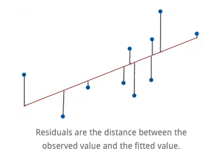
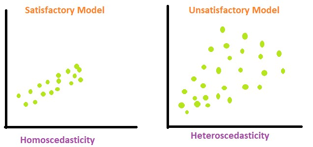
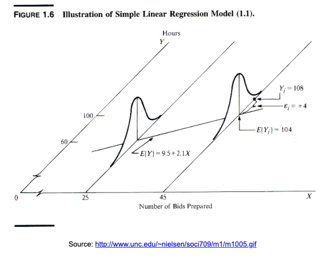
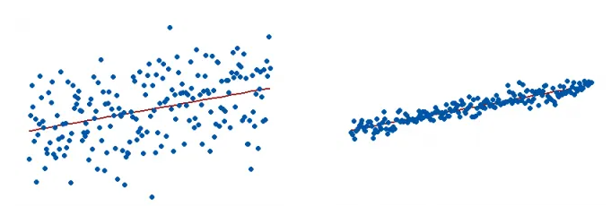
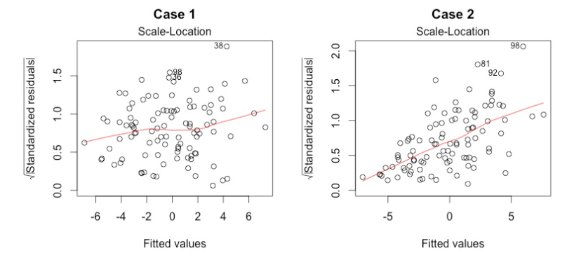
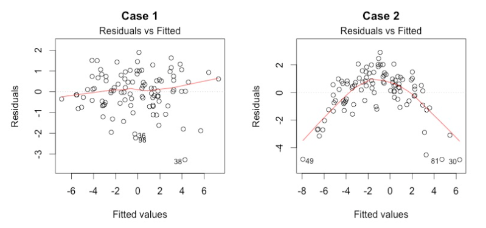
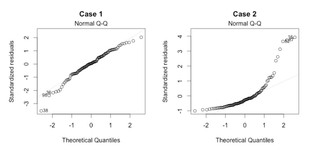
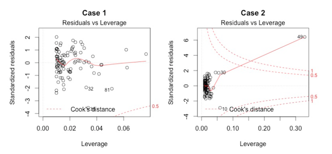
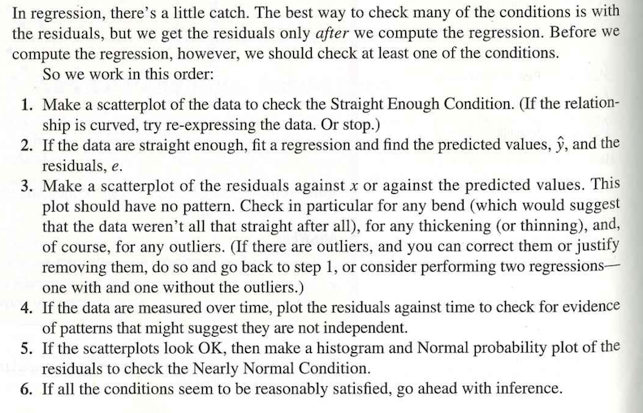

```{r setup, include=FALSE}
knitr::opts_chunk$set(message=FALSE,warning=FALSE, cache=TRUE)
```

Here we discuss how one should run a linear regression in R. There is a special emphasis on explaining what is a model, and how we use it to evaluate the relationship between two variables, x and y, in order to do proper inferences and predictions.


# Linear regression

## What is linear regression? {.unlisted .unnumbered}

The correlation between two variables tells us whether the linear association between them is strong. But it does not tell us *what the line is*.

A linear model gives an equation of a straight line through the data. This model can predict the value y for any value x, which can be within the sample or not.

Of course, no line will go through all the points, but a linear model can summarize the general pattern with only a couple of parameters.

Like all models of the real world, the line will be wrong in the sense that it can't match reality *exactly*, but it can help us understand how the variables are associated.


## Predicted values {.unlisted .unnumbered}

The estimate made from a model is the *predicted value* and we write it as $\hat{y}$ (called *y-hat*) to distinguish it from the observed value, *y*.

The difference between the observed value and its associated predicted value is called the *residual*. The residual value tells us how far off the model's prediction is at that point.

$$
Residual = Observed\ value - Predicted\ value.
$$




## The linear model {.unlisted .unnumbered}

A straight line can be written as
$$
y=mx + b.
$$

We'll use this form for our linear model, but in statistics we use slightly different notation:
$$
\hat{y}= \hat{b}_0 + \hat{b}_1 x.
$$

We write $\hat{y}$ to emphasize that the points that satisfy this equation are just our *predicted* values, not the actual data values, which scatter around the line. 

We write $b_0$ and $b_1$ for the slope and intercept of the line. The estimated $\hat{b}$'s are called the *coefficients* of the linear model, $b_1$ is the slope which tells how rapidly $\hat{y}$ changes with respect to $x$, and $b_0$ is the intercept, which tells where the line intercepts the $y$-axis.


## Interpretation {.unlisted .unnumbered}

Suppose a model is:
$$
\widehat{Fat} = 8.4 + 0.91 Protein.
$$

This means the slope 0.91 says that an item with one more gram of protein can be expected, on average, to have 0,91 more grams of fat. For the intercept, even without protein, an item would have, on average, 8.4 grams of fat. Often the intercept won't be meaningful, but it helps us position the model vertically.

This interpretation works for continuous (quantitative) predictor and outcome, but it's not the same if either changes. More on this later. 


## Warning {.unlisted .unnumbered}

This is where "correlation does not imply causation" becomes very important. It is not the same to say

**"If you increase protein by one gram, fat will increase by one gram,"** as

**"For a higher protein, by one gram, fat is higher by one gram, on average."**

(The second one is correct!) Why are these different?


## Inference vs. prediction {.unlisted .unnumbered}

Inference is about what is the relationship between x and y, and prediction is about if I saw a new x, what would the corresponding y for it be?


## Recall: Assumptions of linear regression {.unlisted .unnumbered}

1. **Homoscedasticity**: Homogeneity of variance. The size of the error in our prediction doesn’t change significantly across the values of the independent variable. i.e., The variance of residuals is the same for any value of $x$.

2. **Independence between observations**: the observations in the dataset were collected using statistically valid sampling methods, and there are no hidden relationships among observations.

3. **Normality**: The data follows a normal distribution. i.e., For any fixed value of $x$, $y$ is normally distributed. 

4. **Linearity**: The relationship between the independent and dependent variable is linear: the line of best fit through the data points is a straight line (rather than a curve or some sort of grouping factor). i.e., The relationship between X and the mean of Y is linear.


## Visualizing assumption 1: Homoscedasticity {.unlisted .unnumbered}

The assumption is that the data is homoscedastic.

 


## Visualizing assumption 2: Independence of observations {.unlisted .unnumbered}

We do not want connections like the ones in this social network:

 


## Visualizing assumption 3: Normality {.unlisted .unnumbered}

 


## Visualizing assumption 4: Linearity {.unlisted .unnumbered}

Actually, this is linearity, homoscedasticity, and normality.

 


## Diagnosic plots {.unlisted .unnumbered}

Diagnosic plots are an amazing tool for checking whether your regression model is fitting well and satisfying assumptions.

We will study four of them that come with the `lm` function in R: 

- Goodness of fit: 
  - R-squared: Coefficient of determination
  - Residuals vs. fitted
- Assumption 1: Homoscedasticity
  - Scale-location 
- Assumption 2: Independence
  - Can't test visually
- Assumption 3: Normality
  - Normal Q-Q plot
  - Residuals vs. leverage
- Assumption 4: Linearity
  - No official plot, but could use a scatterplot.


## Goodness of fit: Coefficient of determination {.unlisted .unnumbered}

How can we tell if a linear model is fitting properly? 

The **coefficient of determination** or $R^2$ is the variation accounted for by the model. $R^2=1$ means your model perfectly predicts the data, i.e., that all of the variance in the data is in the model. $R^2=0$ means your model is not a good fit for the data. 

$$
R^2 = \frac{\text{Variance explained by the model}}{\text{Total variance}}.
$$
It is read as a percentage (i.e., has a value from 0 to 100%). 

The $R^2$ on the left is 15% and the $R^2$ on the right is 85%. 

When a regression model accounts for more of the variance, the data points are closer to the regression line. In practice, you’ll never see a regression model with an R2 of 100%.

Regression models with low R-squared values can be perfectly good models. Some fields of study have an inherently greater amount of unexplainable variation. In these areas, $R^2$ values are bound to be lower.




## Scale-location plot: A way to test assumption 1 (homoscedasticity) {.unlisted .unnumbered}

It’s also called Spread-Location plot. This plot shows if residuals are spread equally along the ranges of predictors. This is how you can check the assumption of equal variance (homoscedasticity). It’s good if you see a horizontal line with equally (randomly) spread points.



## Residuals vs. fitted plot: A more informative version of $R^2$ {.unlisted .unnumbered}

We want to know how well the model fits, so we can ask instead what the model missed: the residuals. A scatterplot of the residuals vs. the $x$-values should be the most boring scatterplot you've ever seen: It shouldn't have any interesting features, like a direction, shape, or outliers (left figure). 




## Normal Q-Q plot: A way to test assumption 3 (normality) {.unlisted .unnumbered}

This plot shows if residuals are normally distributed. Do residuals follow a straight line well or do they deviate severely? It’s good if residuals are lined well on the straight dashed line.  What do you think? They are probably never a perfect straight line, and this will be your call. Case 2 below definitely concerns me. I would not be concerned by Case 1 too much, although an observation numbered as 38 looks a little off.



## Residuals vs. leverage plot: A way to test for points of high leverage {.unlisted .unnumbered}

This plot helps us to find influential cases, if there are any. Not all outliers are influential. Unlike the other plots, here patterns are not relevant. We watch out for outlying values at the upper right corner or at the lower right corner. Those spots are the places where cases can be influential for the model. 

Look for cases outside of a dashed line, Cook’s distance. When cases are outside of the Cook’s distance (meaning they have high Cook’s distance scores), the cases are influential to the regression results. The regression results will be altered if we exclude those cases.



## Residuals vs. leverage plot {.unlisted .unnumbered}

Case 1 is the typical look when there is no influential case, or cases. You can barely see Cook’s distance lines (a red dashed line) because all cases are well inside of the Cook’s distance lines. In Case 2, a case is far beyond the Cook’s distance lines (the other residuals appear clustered on the left because the second plot is scaled to show larger area than the first plot). The plot identified the influential observation as #49. If I exclude the 49th case from the analysis, the slope coefficient changes from 2.14 to 2.68 and $R^2$ from .757 to .851. Pretty big impact!


## Other tools to improve model fit {.unlisted .unnumbered}

Your current model might not be the best way to understand your data. In that case, you may want to go back to the beginning. Is it really a linear relationship between the predictors and the outcome? 

There are other tools we have not covered yet, which might make the model fit the data better:

- You may want to include a quadratic term, for example. 
- A log transformation may better represent the phenomena that you’d like to model. 
- Or, is there any important variable that you left out from your model? Other variables you didn’t include (e.g., age or gender) may play an important role in your model and data. 
- Or, maybe, your data were systematically biased when collecting data. You may want to redesign data collection methods.


## Example: Simulated height and weight data {.unlisted .unnumbered}

```{r, echo=TRUE, eval=TRUE}
x <- c(151, 174, 138, 186, 128, 136, 179, 163, 152, 131)
y <- c(63, 81, 56, 91, 47, 57, 76, 72, 62, 48)
out <- lm(y~x)
summary(out)
```


## Diagnostic plots {.unlisted .unnumbered}

```{r, fig.width=8, fig.height=8}
par(mfrow=c(2,2))
summary(out)
```

```{r}
setwd("/Users/mariacuellar/Github/crim_data_analysis/data/")
```

```{r, echo=TRUE, eval=TRUE}
library(tidyverse)
dat <- read_csv(file = "/Users/mariacuellar/Github/crim_data_analysis/data/dat.nsduh.small.csv")

plot(dat$mjage, log(dat$cigage))

lm.out <- lm(mjage~log(cigage), data=dat)
```

```{r, fig.width=8, fig.height=8}
par(mfrow=c(2,2)) # Change the panel layout to 2 x 2
plot(lm.out)
```


# Example: Cars

We will be using an example from the `cars` dataset in R. This comes with R in the `datasets` package. 

```{r}
# install.packages("datasets") # only run this once per session!
library(datasets)
```

The data give the speed of cars (in miles per hour, mph) and the distances taken to stop (in miles). The data were recorded in the 1920s.

# (Scatterplot)

This is what the scatterplot of speed vs distance looks like. 

```{r, fig.width=7, fig.height=5}
library(datasets)
plot(cars$speed, cars$dist,  main="Relationship between Speed and Stopping Distance for 50 Cars",
	xlab="Speed in mph", ylab="Stopping Distance in feet")
```

It kind of looks like there could be a linear relationship between the two variables, something like the blue line here. (Never mind how I plotted this blue line. I just included it here to show you that the line of best fit probably looks something like this blue line.)
```{r, fig.width=7, fig.height=5}
library(datasets)
reg.output.nc <- lm(formula = dist ~ speed, data = cars)

plot(cars$speed, cars$dist,  main="Relationship between Speed and Stopping Distance for 50 Cars",
	xlab="Speed in mph", ylab="Stopping Distance in feet")
abline(reg.output.nc, col="blue")

```

This blue line tells us there is a positive correlation between how fast the car is going and how far the car needs to go to stop. In fact, the correlation is
```{r}
cor(cars$speed, cars$dist)
```

So, the fact that the relationship looks linear tells us that perhaps a simple linear regression is a good model to fit to this dataset. That regression model will serve as a tool for us to be able to perform inferences (e.g. if I observe a higher stopping distance, is this associated with a higher speed? And if so by how much?) and make predictions (e.g. for a speed of 22 mph or 50 mph, neither of which are in the dataset, what is the estimated stopping distance?).


# Linear model

## The model {.unlisted .unnumbered}

- The linear regression model assumes that the *means* of the distributions of y's for each x fall along the line, even though the individuals are scattered around it. 

- The **model** is
$$
\mu_y = \beta_0 + \beta_1 x.
$$
We use Greek letters to denote idealized models. Whenever we use linear regression, we're assuming that this is actually how the data points are distributed. 

- Are the data really going to be distributed like this?


## The errors {.unlisted .unnumbered}

- No, not all the individual y's are at these means. Some are above, some below. So, like all models, this one makes **errors**. They are model errors so we call them $\epsilon$.

- When we include the errors, we can actually say that each individual y is along the line, with some variation,
$$y = \beta_0 + \beta_1 x + \epsilon,$$ 
where $x$ and $y$ are each individual point's $x$ and $y$ values, the $\beta$s are the **parameters** of the model (slope and intercept), and $\epsilon$ are the model errors that soak up the deviation from the model to the actual point. This equation is true for each data point.


## The regression line {.unlisted .unnumbered}

- We estimate the $\beta$s by finding a **regression line** 
$$\hat{y} = b_0 + b_1 x,$$
as in the previous class. The **residuals**, $e=y-\hat{y}$ are the sample-based versions of the errors $\epsilon$. 

- We use a method called **least squares regression**, which minimizes the vertical distance from the data points to the regression line (the sum of the squares of the residuals), to get reasonable estimates of the parameters of this model from a random sample of data.

- **Important note**: We don't expect the assumptions to be exactly true, and we know that all models are wrong, but the linear model is often close enough to be very useful. 


# Procedure for linear regression

So, we have an idealized model that we're going to use to see if there are interesting relationships between our variables. But, we're not sure it's the right model to use. Should we just go ahead and use it even if it's the wrong model, and then later see if it worked? Doesn't that seem dishonest? How can we use the model and the diagnostics properly?

We have some visual tests we can use before running the regression (does the scatterplot of y vs. x data look like it's distributed like a line?) and diagnostics that we can use after running the regression. We'll use these tools in the right order to run a linear model. 

The following is a reasonable procedure from DVB. Note that although this seems like a simple algorithm, it's not always the right thing to do. Remember this is statistics: you need a human deciding whether the assumptions you are making are too strong, and whether the diagnostics you're checking look good enough. That's why we go over the assumptions and the diagnostics later on. On a test, you should be able to respond to questions about whether you think each of the four assumptions is satisfied. 




# R linear regression formula and output

Note: We are going to use a trick here called scaling the data. All this does is give us an easier time interpreting the y-intercept. You do not need to scale the data in most cases.

```{r, fig.width=7, fig.height=5}
cars$speed.c = scale(cars$speed, center=TRUE, scale=FALSE) # scaling the data
reg.output <- lm(formula = dist ~ speed.c, data = cars) # running regression
summary(reg.output) # calling the summary of the fitted model
```

The model above is achieved by using the `lm()` function in R and the output is called using the `summary()` function on the model. [Cite: Felipe Rego.]

- **Formula call**: The first item shown in the output is the formula R used to fit the data. Note the simplicity in the syntax: the formula just needs the predictor (x) and the target/response variable (y), together with the data being used (dat).

- **Residuals**: The next item in the model output talks about the residuals. Residuals are essentially the difference between the actual observed response values (distance to stop dist in our case) and the response values that the model predicted.

- **Coefficient - Estimate**: The coefficient Estimate contains two rows; the first one is the intercept. The intercept, in our example, is essentially the expected value of the distance required for a car to stop when we consider the average speed of all cars in the dataset. In other words, it takes an average car in our dataset 42.98 feet to come to a stop. The second row in the Coefficients is the slope, or in our example, the effect speed has in distance required for a car to stop. The slope term in our model is saying that for every 1 mph increase in the speed of a car, the required distance to stop goes up by 3.9324088 feet. NOTE: This is not a causal interpretation. Just make sure you say that a higher value of speed is associated with higher values of distance, by this much, but don't say that if you increase one the other one will increase. 

- **Coefficient - Standard Error**: The coefficient Standard Error measures the average amount that the coefficient estimates vary from the actual average value of our response variable. We’d ideally want a lower number relative to its coefficients. In our example, we’ve previously determined that for every 1 mph increase in the speed of a car, the required distance to stop goes up by 3.9324088 feet. The Standard Error can be used to compute an estimate of the expected difference in case we ran the model again and again. In other words, we can say that the required distance for a car to stop can vary by 0.4155128 feet. The Standard Errors can also be used to compute confidence intervals and to statistically test the hypothesis of the existence of a relationship between speed and distance required to stop.

- **Coefficient - t-value**: The coefficient t-value is a measure of how many standard deviations our coefficient estimate is far away from 0. We want it to be far away from zero as this would indicate we could reject the null hypothesis - that is, we could declare a relationship between speed and distance exist. In our example, the t-statistic values are relatively far away from zero and are large relative to the standard error, which could indicate a relationship exists. In general, t-values are also used to compute p-values.

- **Coefficient - Pr(>t)**: The Pr(>t) acronym found in the model output relates to the probability of observing any value equal or larger than t. A small p-value indicates that it is unlikely we will observe a relationship between the predictor (speed) and response (dist) variables due to chance. Typically, a p-value of 5% or less is a good cut-off point. In our model example, the p-values are very close to zero. Note the ‘signif. Codes’ associated to each estimate. Three stars (or asterisks) represent a highly significant p-value. Consequently, a small p-value for the intercept and the slope indicates that we can reject the null hypothesis which allows us to conclude that there is a relationship between speed and distance.

- **Residual Standard Error**: Residual Standard Error is measure of the quality of a linear regression fit. Theoretically, every linear model is assumed to contain an error term E. Due to the presence of this error term, we are not capable of perfectly predicting our response variable (dist) from the predictor (speed) one. The Residual Standard Error is the average amount that the response (dist) will deviate from the true regression line. In our example, the actual distance required to stop can deviate from the true regression line by approximately 15.3795867 feet, on average. In other words, given that the mean distance for all cars to stop is 42.98 and that the Residual Standard Error is 15.3795867, we can say that the percentage error is (any prediction would still be off by) 35.78%. It’s also worth noting that the Residual Standard Error was calculated with 48 degrees of freedom. Simplistically, degrees of freedom are the number of data points that went into the estimation of the parameters used after taking into account these parameters (restriction). In our case, we had 50 data points and two parameters (intercept and slope).

- **Multiple R-squared, Adjusted R-squared**:  The R-squared (R2) statistic provides a measure of how well the model is fitting the actual data. It takes the form of a proportion of variance. R2 is a measure of the linear relationship between our predictor variable (speed) and our response / target variable (dist). It always lies between 0 and 1 (i.e.: a number near 0 represents a regression that does not explain the variance in the response variable well and a number close to 1 does explain the observed variance in the response variable). In our example, the R2 we get is 0.6510794. Or roughly 65% of the variance found in the response variable (dist) can be explained by the predictor variable (speed). Step back and think: If you were able to choose any metric to predict distance required for a car to stop, would speed be one and would it be an important one that could help explain how distance would vary based on speed? I guess it’s easy to see that the answer would almost certainly be a yes. That why we get a relatively strong R2. Nevertheless, it’s hard to define what level of R2 is appropriate to claim the model fits well. Essentially, it will vary with the application and the domain studied.

- A side note: In multiple regression settings, the R2 will always increase as more variables are included in the model. That’s why the adjusted R2 is the preferred measure as it adjusts for the number of variables considered.

- **F-Statistic**: F-statistic is a good indicator of whether there is a relationship between our predictor and the response variables. The further the F-statistic is from 1 the better it is. However, how much larger the F-statistic needs to be depends on both the number of data points and the number of predictors. Generally, when the number of data points is large, an F-statistic that is only a little bit larger than 1 is already sufficient to reject the null hypothesis (H0 : There is no relationship between speed and distance). The reverse is true as if the number of data points is small, a large F-statistic is required to be able to ascertain that there may be a relationship between predictor and response variables. In our example the F-statistic is 89.5671065 which is relatively larger than 1 given the size of our data.


Now we revisit the assumptions.

# 1. Linearity assumption

- This is satisfied if a scatterplot of x and y looks straight. If the true relationship between x and y is far from linear and we use a straight line to fit the data, our entire analysis will be useless, so we always check this first.

- **How to check?** You can see violations of this if you plot a scatterplot of the residuals against x or against the predicted values $\hat{y}$. That plot will have a horizontal direction and should have no pattern if the condition is satisfied. You can think of the residuals as being estimates of the error terms. So anytime we’re looking at a plot that involves residuals, we’re doing so because we’re trying to assess whether some assumption about the errors appears to hold in our data.


# (Residuals vs. x)

```{r}
plot(cars$speed.c, reg.output$residuals, ylim=c(-15,15), main="Residuals vs. x", xlab="x, Scaled speed", ylab="Residuals")
abline(h = 0, lty="dashed")
```

# (Residuals vs. fitted)

```{r,echo=TRUE, fig.width=5, fig.height=5}
plot(reg.output, which=1)
```

- Looking at the Residuals vs Fitted plot (showing residuals on the y-axis and fitted y's on the x-axis), we see that the red line (which is just a scatterplot smoother, showing the average value of the residuals at each value of fitted value) is quite flat. This tells us that there is no discernible non-linear trend to the residuals. Furthermore, the residuals appear to be equally variable across the entire range of fitted values. There is no indication of non-constant variance.


# 2. Independence assumption

- The errors in the true underlying regression model (the $\epsilon$s) must be independent of each other. There is no way to check this is true. 
We check displays of the regression residuals for evidence of patterns, trends, or clumping, any of which would suggest a failure of independence. e.g. For time series, the error our model makes today may be similar to the one it made for yesterday.

- **How to check?** You can see violations of this by plotting the residuals against x and looking for patterns (see plot above). Or, plot the residuals vs. the residuals offset or lagged by one time position. Neither plot should show patterns.

- In our example this looks pretty good. We don't need to plot the residuals vs. the lagged residuals because we don't think there's a time-series component in the data.


# 3. Equal variance assumption/homoscedasticity

- The variability in y should be about the same for all values of x. The standard deviation of the residuals "pools" information across all of the individual distributions at each x-value, and pooled estimates are appropriate only when they combine information for groups with the same variance.

- **How to check?** A scatterplot of y against x offers a visual check (we did this all the way at the top). Be alert for a "fan" shape or other tendency for the variation to grow or shrink in one part of the scatterplot. Often, it is better to look at the residuals plotted against the predicted values $\hat{y}$.

# (Scale-location plot)

```{r, echo=TRUE, fig.width=5, fig.height=5}
plot(reg.output, which=3)
```

- The scale-location plot is a more sensitive approach to looking for deviations from the constant variance assumption. If you see significant trends in the red line on this plot, it tells you that the residuals (and hence errors) have non-constant variance. That is, the assumption that all the errors have the same variance is not true. 

- When you see a flat line like what’s shown above, it means your errors have constant variance, like we want to see.


# 4. Normal population assumption

- We assume the errors around the idealized regression line at each value of x follow a Normal model. **Why?** We need this assumption so we can use Student's t-model for inference. 

- This assumption becomes less important as the same size grows because the model is about means and the Central Limit Theorem takes over. 

- **How to check?** Nearly normal condition (qq plot) and outlier condition (Cook's distance). 


# (Residuals vs. Leverage plot)

```{r,echo=TRUE, fig.width=5, fig.height=5}
plot(reg.output, which=5)
```

- There’s no single accepted definition for what consitutes an outlier. One possible definition is that an outlier is any point that isn’t approximated well by the model (has a large residual) and which significantly influences model fit (has large leverage). This is where the Residuals vs Leverage plot comes in.


# (Normal qq plot)

```{r, echo=TRUE, fig.width=5, fig.height=5}
plot(reg.output, which=2)
```

- The Normal QQ plot helps us to assess whether the residuals are roughly normally distributed. If the residuals look far from normal we may be in trouble. In particular, if the residual tend to be larger in magnitude than what we would expect from the normal distribution, then our p-values and confidence intervals may be too optimisitic. i.e., we may fail to adequately account for the full variability of the data.

- This qq plot is not great, especially at the top right. This tells us that the right tail of the distribution is probably "light" or smaller than usual for a normal distribution. 

- The images below are a guide that tells you what might be happening.


# References {.unlisted .unnumbered}

- DVB Chp 25

- https://feliperego.github.io/blog/2015/10/23/Interpreting-Model-Output-In-R

- https://www.andrew.cmu.edu/user/achoulde/94842/homework/regression_diagnostics.html

- https://stats.stackexchange.com/questions/101274/how-to-interpret-a-qq-plot

- https://data.library.virginia.edu/diagnostic-plots/


