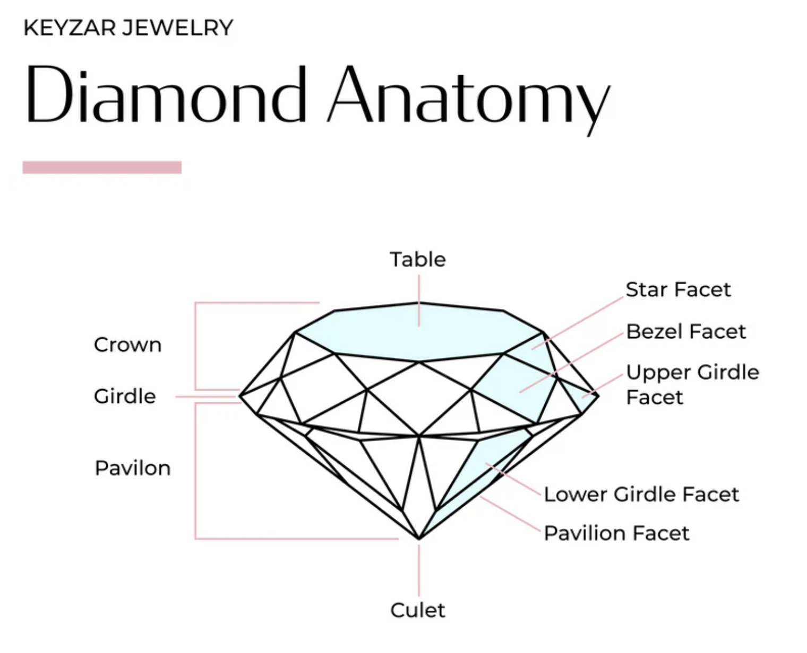

```{r setup, include=FALSE}
knitr::opts_chunk$set(echo = TRUE)
```

# ggplot

The Grammar of Graphics was a book published in 1999 by a statistician named Leland Wilkinson, and later Hadley Wickham used it to write a package called ggplot in R. ggplot stands for Grammar of Graphics plot. 

It is called a grammar because it is a structure for producing plots that resembles a language. Nearly every current software tool used to build plots has been informed by this book. Its influence can be found in Tableau, Plotly, and the Python libraries bokeh, altair, seaborn, and plotnine. The most complete implementation of the grammar is found in an R package called ggplot2 by Hadley Wickham.


In Wickham’s adaptation of the grammar of graphics, a plot can be decomposed into seven elements:

- *Data*: The data frame that contains the data you want to visualize.
- *Aesthetic* (aes) mapping of the variables in the data to visual cues: What is your x or y.

Why it’s called "aesthetics": It's not about style or beauty — it’s about visual mappings. An aesthetic is anything that controls what you see on the plot. (x and y, color, fill, shape, size, alpha (transparency), linetype). This contrasts with "settings". If you don’t want an aesthetic to depend on data, you set it outside aes(). For example: `ggplot(mtcars, aes(x = mpg, y = hp)) + geom_point(color = "red")`. 

- *Geometry*: Is used to encode the observations on the plot: What kind of plot you’re making, a histogram, a bar plot, a line, etc.
- *Facets*: If you want to split up the plots by categories, e.g., one plot for females and one for males.




- *Statistics*: If you want to fit a model to the data. Geoms decide how to draw (points, lines, bars). Stats decide what to draw by computing summaries (counts, means, model fits).
- *Coordinates*: If you want to change the scales.
Theme: If you want to make it pretty.


# Data

We will use the `mpg` dataset, which is built into the `ggplot2` package, which is part of the `tidyverse` package.

```{r, message=FALSE}
# load packages
library(tidyverse)
library(ggthemes)
```

```{r}
# See the data we'll be using
mpg
```

We will use the variables `cty` and `hwy` as our quantitative variables, and the variables `drv`, `cyl` as our categorical ones.


# Different elements of a plot

If you only use ggplot, then nothing happens.
```{r, fig.width=4, fig.height=3}
mpg %>% ggplot()
```

If you add the aesthetics, you get a coordinate system where the plot will go. We've defined two variables, x and y, that are quantitative variables.
```{r, fig.width=4, fig.height=3}
mpg %>% ggplot(aes(x=cty))
```

If you then add the geometry (shortened as geom), then you get a plot.
```{r, fig.width=4, fig.height=3}
mpg %>% ggplot(aes(x=cty)) + geom_histogram()
```

You can change the color of the points for fun, without having any particular meaning. Note that there is no legend. This is SETTING a constant color, not mapping (no legend). That's why it's outside aes.
```{r, fig.width=4, fig.height=3}
mpg %>% ggplot(aes(x=cty)) + geom_histogram(color = "steelblue", fill="darkblue")
```

Or you can use color with meaning. Here we use it to tell us how the points split up by a third categorical variable, drv. This splits up the points by color, one for each category of drv. This is MAPPING color to a variable (legend appears).
```{r, fig.width=4, fig.height=3}
mpg %>% ggplot(aes(x=cty, fill = drv)) + geom_histogram()
```

You can use facets instead to see the differences in the points according to a third categorical variable. This splits up the plot into three plots, one for each category of drv. 

```{r, fig.width=4, fig.height=3}
mpg %>% ggplot(aes(x=cty)) + geom_histogram() + facet_grid(~drv)
```

You can also change the coordinates (although we won't do this often).

```{r, fig.width=4, fig.height=3}
# coord_polar() for pie/polar charts
mpg %>% ggplot(aes(x=cty)) + geom_histogram() + coord_polar()
```

You can add "statistics", meaning some modeling to your plot. Note that ggplot is doing this in the background - we will learn later how to model ourselves.

```{r, fig.width=4, fig.height=3}

mpg %>% ggplot(aes(x=cty)) + 
  geom_histogram(bins=40, aes(y = after_stat(density))) + 
  stat_density(geom = "line", color = "blue", linewidth = 1) + # Computes a kernel density estimate
  stat_function(fun = dnorm, 
                args = list(mean = mean(mpg$cty), sd = sd(mpg$cty)),  # Plots any function (e.g., theoretical Normal distribution)
                color = "red", linetype = "dashed", linewidth=1.5)

```

Finally, you can change the look of the plot.

Themes are made for you:
```{r, fig.width=4, fig.height=3}
mpg %>% ggplot(aes(x=cty)) + geom_histogram() + theme_economist() 
# make sure you've loaded the ggthemes package
```

And you can also change the palettes. There's a nice set of palettes called the Brewer palettes:  https://r-graph-gallery.com/38-rcolorbrewers-palettes.html. Designed by Cynthia Brewer: https://en.wikipedia.org/wiki/Cynthia_Brewer.

```{r, fig.width=4, fig.height=3}
mpg %>% ggplot(aes(x=cty, fill=drv)) + geom_histogram() + scale_fill_brewer(palette = "Dark2")
```


# Single variable EDA


## Quantitative varible: 

### Histogram

Plot a histogram to visualize a single quantitative variable.

```{r, fig.width=4, fig.height=3}
mpg %>% ggplot(aes(x=cty)) + geom_histogram()
```

### Boxplot

Plot a boxplot to visualize a single quantitative variable.

```{r, fig.width=2, fig.height=3}
mpg %>% ggplot(aes(y=cty)) + geom_boxplot()
```


## Categorical variable

### Barplot

Draw a barplot to visualize a single categorical variable.

```{r, fig.width=4, fig.height=3}
mpg %>% ggplot(aes(x=drv)) + geom_bar()
```


### Pie chart
(Actually, don't use pie charts. They're often more deceiving than helpful - this is because humans are bad at comparing areas to each other. Just stick to barplots, or tables.)
```{r, fig.width=4, fig.height=3}
#mpg %>% ggplot(aes(x="", fill=drv)) + geom_bar() + coord_polar("y") + theme_void()
```


## Two categorical variables


### Side-by-side barplots

```{r, fig.width=4, fig.height=3}
mpg %>% ggplot(aes(x=cyl)) + geom_bar() + facet_grid(~drv)
```


### Different color barplots

Note: position dodge is almost always prefereable to identity because identity stacks the bars up, and it's very difficult for humans to compare the sizes of the bars when they start at different heights.

```{r, fig.width=4, fig.height=3}
mpg %>% ggplot(aes(x=cyl, fill=factor(drv))) + geom_bar(position="dodge") 
# note that sometimes if you don't add factor for the aesthetics, ggplot gets confused

```


## A quantitative variable and a categorical variable


### Side-by-side histograms

```{r, fig.width=4, fig.height=3}
mpg %>% ggplot(aes(x=cty)) + geom_histogram() + facet_grid(~drv)
```

### Side-by-side boxplots

```{r, fig.width=4, fig.height=3}
mpg %>% ggplot(aes(y=cyl)) + geom_boxplot() + facet_grid(~drv)
```

# Different color histograms

```{r, fig.width=4, fig.height=3}
mpg %>% ggplot(aes(x=cty, fill=factor(drv))) + geom_histogram(alpha=.7)
```


## Two quantitative variables

### Scatterplot

```{r, fig.width=4, fig.height=3}
mpg %>% ggplot(aes(x=cty, y=hwy)) + geom_point()
```


# Two quantitative variables and a categorical variable

### Scatterplot with different colors by the categories.

```{r, fig.width=4, fig.height=3}
mpg %>% ggplot(aes(x=cty, y=hwy, color=drv)) + geom_point()
```


# Three quantitative variables

### Scatterplot with different colors by the shade of the third quant variable.

```{r, fig.width=4, fig.height=3}
mpg %>% ggplot(aes(x=cty, y=hwy, color=displ)) + geom_point()
```

